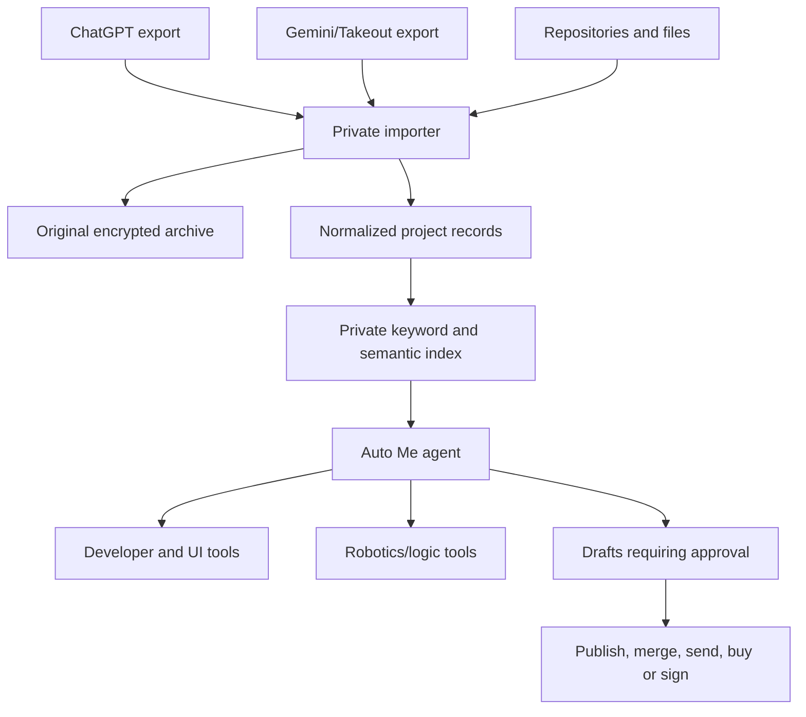

# Auto Me Architecture

## Outcome

Auto Me is the website-resident Infinity builder that searches Kris's authorized history and current repositories, answers with source citations, prepares work and operates approved tools. It is designed to reduce dependence on a particular chat session while preserving truth about what is and is not running.

## Data flow

## Import contract

Each imported conversation retains:

- source platform;
- original conversation identifier and title;
- message identifier, author role and timestamp;
- exact original text;
- attachment/link references;
- import batch and checksum;
- privacy and publication state;
- extracted projects, decisions, preferences, tasks and claims;
- citations pointing back to the exact source message.

Extraction never overwrites the original. Later decisions can supersede earlier decisions while both remain visible.

## Assistant layers

1. **Developer assistant:** repository search, diagnosis, code drafts, tests and PR preparation.
2. **UI builder:** responsive pages, Avatar Coin markers, previews, components and design systems.
3. **Robotics/logic assistant:** simulators, device planning, approved hardware control, limits and safety logs.
4. **Combined builder:** routes a request across all three specialties while maintaining one plan and provenance chain.

## Approval gates

Auto Me may search, summarize, simulate and draft without pretending an external action occurred. It requires explicit approval before:

- publishing or merging;
- sending messages as Kris;
- spending or transferring value;
- accepting legal/commercial terms;
- signing a document or operating Auto Pen;
- initiating physical-device motion;
- making private material public.

## API boundary

The browser sends a signed-in request to the Infinity server. The server retrieves only relevant private records, calls the model, validates requested tools and returns cited results. API keys, service credentials and unredacted archives remain server-side.

ChatGPT history is obtained through the user's authorized data export. Gemini history is obtained through the user's authorized Google export. Auto Me does not scrape signed-in accounts, reuse cookies or ask for passwords.

## First working milestone

The first deployable Auto Me version should:

1. accept a ChatGPT `conversations.json` file locally;
2. preview the conversation count and date range;
3. let Kris exclude selected conversations;
4. normalize and hash approved messages;
5. search those messages locally;
6. answer with exact conversation citations;
7. export the normalized archive;
8. delete the imported archive completely.

Only after that importer is verified should server-side model access and tool execution be connected.
